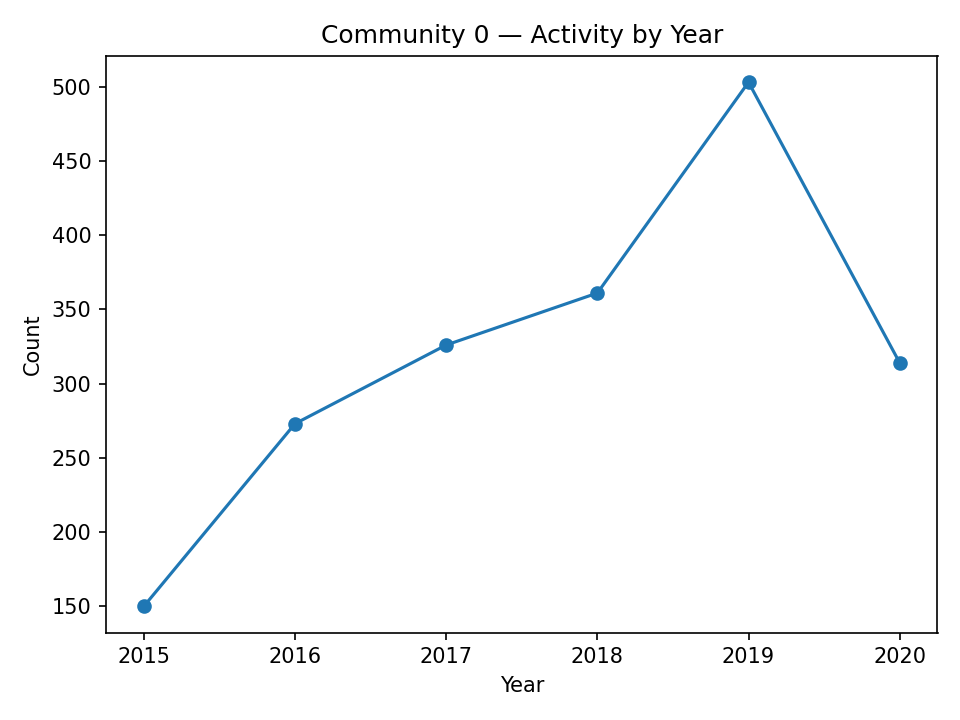
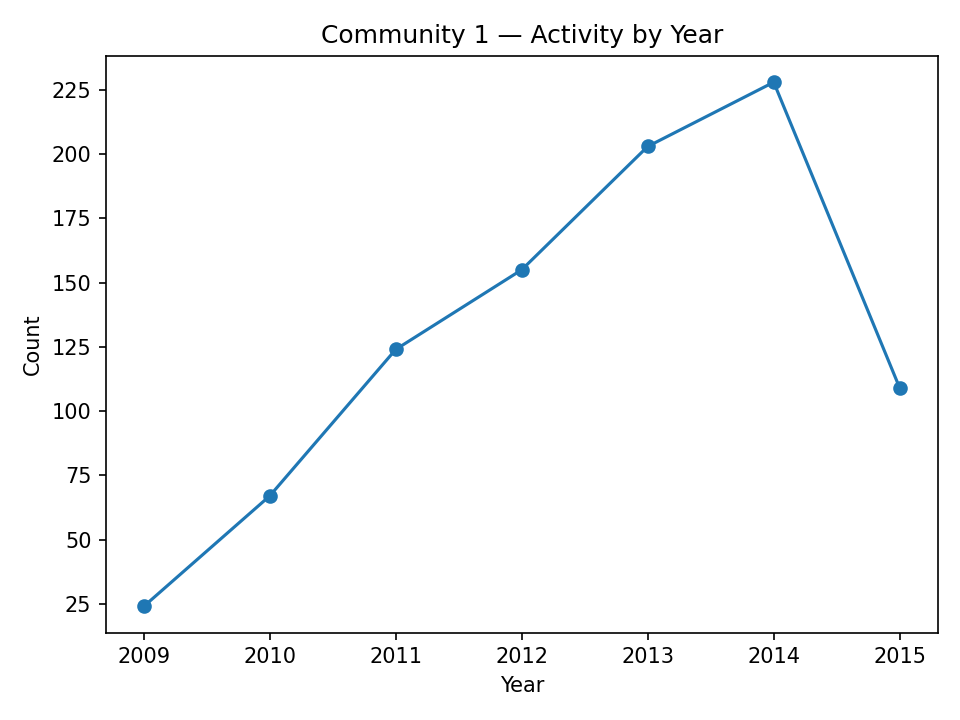

# 母題進化リポート

**时间范围**：2009–2020  
**母题簇数量**：2  **节点数**：185  **边数**：1866

## 1. 魔法少女と呪いの物語  
**年份**：2015–2020  **规模**：98  **PR总和**：0.5471  **度数总和**：2136  **最大桥梁性**：0.5764
**关键词**：為る, 居る, 世界, 令嬢, 成る, 有る, 私-代名詞, 様, 人, 者

本社群は 2015 年から 2020 年にかけて持続的に現れ、代表的な語は 為る, 居る, 世界, 令嬢, 成る, 有る, 私-代名詞, 様, 人, 者 である。

## 2. 聖女の伝説と少女  
**年份**：2009–2015  **规模**：87  **PR总和**：0.4529  **度数总和**：1596  **最大桥梁性**：0.4824
**关键词**：為る, 世界, 有る, 居る, 成る, 私-代名詞, 物語, 達, 死ぬ, 中

本社群は 2009 年から 2015 年にかけて持続的に現れ、代表的な語は 為る, 世界, 有る, 居る, 成る, 私-代名詞, 物語, 達, 死ぬ, 中 である。
